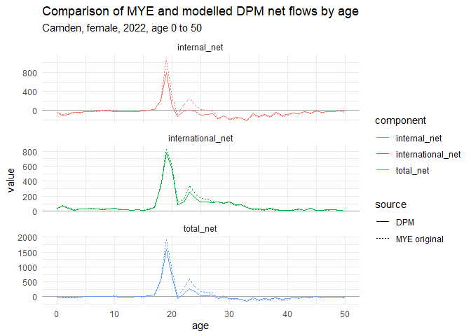

<!-- README.md is generated from README.Rmd. Please edit that file -->

# convert_upc

This repository contains two related examples of: \* how the
Unattributable Population Change (UPC) component included in the rebased
ONS mid-year estimate (MYE) population back series could be replaced
with adjustments to the existing annual international migration
estimates. \* how total in- and out-flows in ONS’s current Admin-Based
Population Estimates (ABPE)/Dynamic Population Model (DPM) estimates
could be split into separate international and domestic flows.

## Converting UPC in the rebased MYE series

The method shown here uses a single function that takes an initial pair
gross flows, together with a target net value, and returns new gross
flows that are consistent with this net figure and represent the minimum
‘cost’ change to the original flows.

This function was originally developed by the GLA in its process for
creating the [rebased population
estimates](https://data.london.gov.uk/dataset/modelled-population-backseries)
used as a basis for the GLA’s population projections.

The full GLA rebasing process is complex and involves fitting new annual
net flows before splitting these out into gross flows and building a
consistent annual population series.

However, if the goal is just to reassign already calculated UPC to
international flows, without modifying the estimated population, then
the process is greatly simplified.

## Splitting ABPE total flows

This method repurposes the function used for modifying a pair of base
in- and out-flows to fit a target net flow such that it instead modifies
a pair of flows with the same direction to fit a total figure, while
accounting for the user’s relative confidence in the accuracy of the
base international and domestic flow estimates.

Here the base domestic and international flows are taken from the ONS
rebased MYE series and used to split the total flow components in the
published ABPE/DPM series.

Confidence in the accuracy of flow estimates will vary by area, age,
sex, direction, and year. In this example, an arbitrary value of 0.98
has been used for the confidence parameter in all cases - with values
below 1 implying lower confidence in the accuracy of the original
estimates of international migration than of domestic.

## Instructions

The two processes are run from the scripts
*R/run_process_ons2023_mye_series.R* and
*R/run_process_ons_dpm_series.R*, respectively.

*R/run_process_ons2023_mye_series.R* will:

- Fetch and clean the detailed mid-year estimates series published by
  ONS that covers the period 2011 to 2023

- Create modelled alternative annual international gross flows that are
  consistent with the sum of the international_net and UPC components

- Write out the new series to *data/processed/* as both an RDS file in
  tidy format and as a csv in a similar format to that originally
  published by ONS

*R/run_process_ons_dpm_series.R* will:

- Fetch and clean the detailed mid-year estimates series published by
  ONS that covers the period 2011 to 2023

- Fetch and clean the current admin-based estimates series published
  July 2024, which also covers the period 2011 to 2023

- Create modelled annual international and internal flow components that
  are consistent with the original total immigration and emigration
  components

- Write out the new series to *data/processed/* as both an RDS file in
  tidy format and as a csv in a similar format to that originally
  published by ONS

### Required packages

dplyr, tidyr, readxl, readr, stringr

# Overview of methodologies

## Converting UPC in the rebased MYE series

In population modelling, it is often the case that we wish to make an
adjustment to the size of a population stock or net migration flow and
must make corresponding adjustment to the size of the underlying gross
flows, such that they remain consistent. When the adjustment to the net
flow is positive, consistent gross flows can be created by some
combination of higher inflows and/or lower outflows (and vice versa). As
a given net flow can be described by any number of different pairs of
in- and out-flows, the problem is to choose the most appropriate values
for the in- and outflows.

The approach taken by the GLA to this problem is to try and identify
adjustments that minimise (from a statistical perspective) changes from
the original gross flow estimates.

- Gross flows are treated as having an underlying probability density
  described by a Poission distribution with means equal to the original
  estimates.

- Starting from the initial values of the gross flows, an incremental
  adjustment is made to either the inflow or outflow according to which
  would see the smaller decrease in the probability density after the
  adjustment is made.

- Successive incremental adjustments are made until the gross flows are
  consistent with desired net flow.

The relative size of the adjustments to the in- and out-flows is
determined by the sizes of the initial flows and the size and direction
of the adjustment required. In cases where the initial gross flows are
already consistent with the target net, the function will return these
values unchanged.

The example below illustrates how the modelled gross flows for a given
pair of base flows vary with the target net figure.

In this application the target international net flow is taken to be the
sum of the values of the original international net flow and the UPC
component.

The following charts illustrate the original and adjusted data for
females in Camden - a group with a very high UPC component in the
rebased estimates which removes almost 18 thousand persons from the
population over the course of the decade.

As intended, the adjusted gross flows closely track the distributions of
the original estimates by year and by age.

## Splitting total gross flows from the DPM outputs

ONS has stated that it has a goal of making its admin-based population
estimates the official series from 2025. To date, experimental outputs
from the Dynamic Population Model - used to produce the admin-based
estimates - do not include breakdowns of gross flows into separate
domestic and international components. While outputs are eventually
expected to include the full set of components included in the current
official series, the GLA has an interest in understanding how switching
to the admin-based estimates may impact on the results of population
projections so that the upcoming change can be can be accounted for in
its work programme. Here we consider one option for splitting the total
immigration and total emigration flows into international and domestic
components, so that the data can be used as inputs to existing
population models.

The approach makes use of the domestic and international flows from the
rebased MYE series to provide a basis for dividing the ABPE total flows.
The simplest way to split the flows would likely be to simply allocate
the total flows between international and domestic in the same
proportions as in the MYE. The function used here supports this
approach, but also allows the split to account for the relative
confidence the user has in the accuracy of the original international
and domestic flow estimates. If, for example, the user specifies that
they have lower confidence in the international than the domestic
estimates, the function will account for this in the fitting process -
allowing the modelled international flow to more readily deviate from
the base MYE value than it does the domestic when matching the total
flow.

The plot below illustrates how, for a given pair of base flows, the
modelled international and domestic flows vary with both the target
total flow figure and the relative confidence parameter specified,
where:

- a value of 1 represents equal confidence in the original international
  and domestic flow estimates and results in the same proportional split
  as the base flows
- values \< 1 represent lower levels of confidence in the accuracy of
  the original international flow estimates
- values \> 1 represent lower levels of confidence in the accuracy of
  the original domestic flow estimates

The following charts illustrate the modelled flows for the DPM alongside
the original flows from the official mid-year estimates for females in
Camden. In this example, the relative confidence parameter for inflows
has been (arbitrarily) set at 3 for inflows and 0.3 for outflows,
meaning that, effectively, domestic migration will be prioritised for
adjustment when fitting to total inflows and international migration
will be prioritised for adjustment when fitting outflows. In this case,
the relative confidence parameters do not vary by age/sex, but there is
scope to do so to account for known variations in the quality of the
data for particular population groups.

