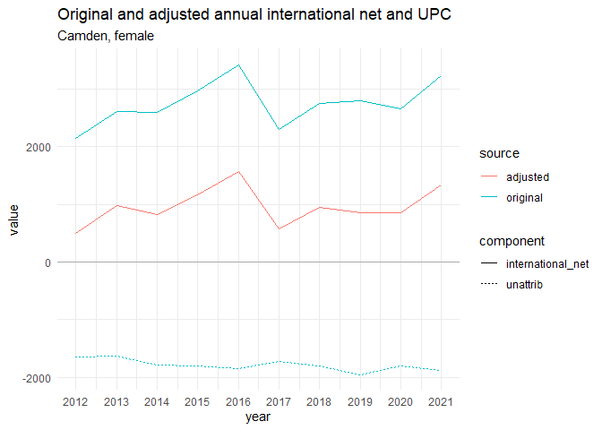

<!-- README.md is generated from README.Rmd. Please edit that file -->

# convert_upc

This is an example of how the Unattributable Population Change (UPC)
component included in the rebased ONS population back series could be
replaced with adjustments to the existing annual international migration
estimates.

The method shown here uses a single function that takes an initial pair
gross flows, together with a target net value, and returns new gross
flows that are consistent with this net figure and represent the minimum
‘cost’ change to the original flows.

This function was originally developed by the GLA in its process for
creating the [rebased population
estimates](https://data.london.gov.uk/dataset/modelled-population-backseries)
used as a basis for the GLA’s population projections.

The full GLA rebasing process is complex and involves fitting new annual
net flows before splitting these out into gross flows and building a
consistent annual population series.

However, if the goal is just to reassign already calculated UPC to
international flows, without modifying the estimated population, then
the process is greatly simplified.

## Instructions

The entire process is run from the script
*R/run_process_ons2023_mye_series.R*

This will:

- Fetch and clean the detailed mid-year estimates series published by
  ONS that covers the period 2011 to 2023
- Create modelled alternative annual international gross flows that are
  consistent with the sum of the international_net and UPC components
- Write out the new series to *data/processed/* as both an RDS file in
  tidy format and as a csv in a similar format to that originally
  published by ONS

### Required packages

dplyr, tidyr, readxl, readr, stringr

# Methodology

In population modelling, it is often the case that we wish to make an
adjustment to the size of a population stock or net migration flow and
must make corresponding adjustment to the size of the underlying gross
flows, such that they remain consistent. When the adjustment to the net
flow is positive, consistent gross flows can be created by some
combination of higher inflows and/or lower outflows (and vice versa). As
a given net flow can be described by any number of different pairs of
in- and out-flows, the problem is to choose the most appropriate values
for the in- and outflows.

The approach taken by the GLA to this problem is to try and identify
adjustments that minimise (from a statistical perspective) changes from
the original gross flow estimates.

- Gross flows are treated as having an underlying probability density
  described by a Poission distribution with means equal to the original
  estimates.

- Starting from the initial values of the gross flows, an incremental
  adjustment is made to either the inflow or outflow according to which
  would see the smaller decrease in the probability density after the
  adjustment is made.

- Successive incremental adjustments are made until the gross flows are
  consistent with desired net flow.

The relative size of the adjustments to the in- and out-flows is
determined by the sizes of the initial flows and the size and direction
of the adjustment required. In cases where the initial gross flows are
already consistent with the target net, the function will return these
values unchanged.

The example below illustrates how the modelled gross flows for a given
pair of base flows vary with the target net figure.

In this application the target international net flow is taken to be the
sum of the values of the original international net flow and the UPC
component.

The following charts illustrate the original and adjusted data for
females in Camden - a group with a very high UPC component in the
rebased estimates which removes almost 18 thousand persons from the
population over the course of the decade.

 As
intended, the adjusted gross flows closely track the distributions of
the original estimates by year and by age.

